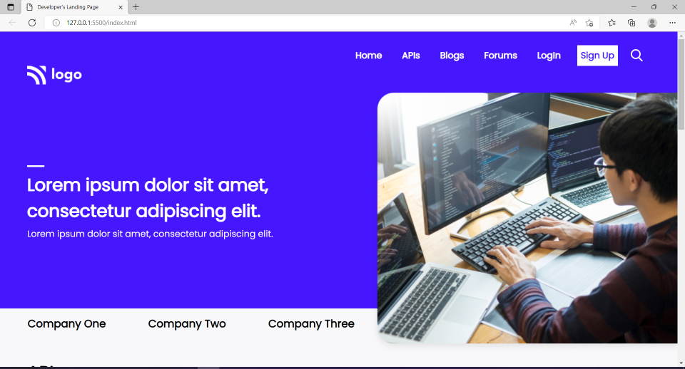
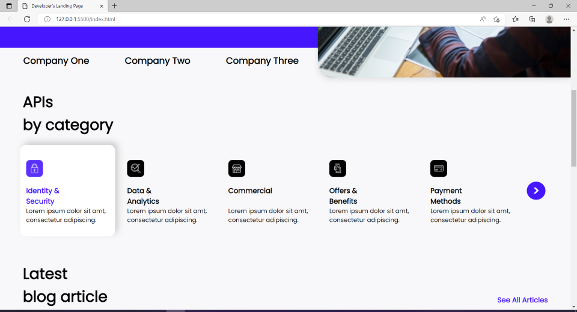
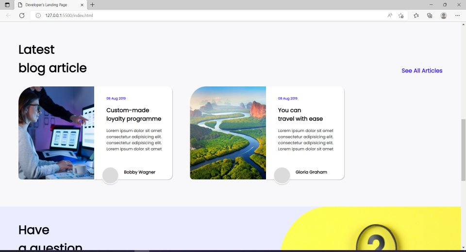
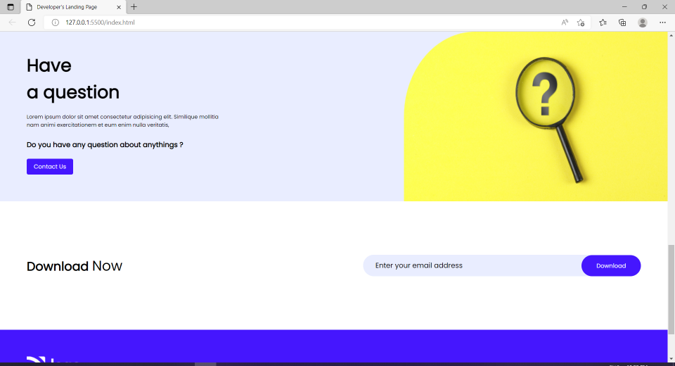
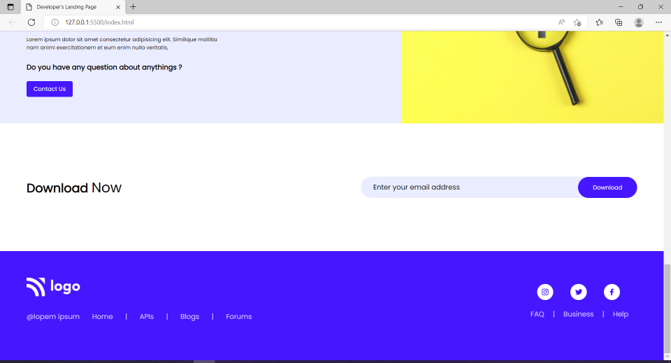

# Project-09 - A-Developer's-Landing-Page

## Description:

> A Developer's website's Landing page which will be the first web page that the potential client will see when he/she reaches developer's website.

# 

**Landing-Page-Images:**

#

## What I have learnt while making this project?

> This project took quite some time as there were some parts which required a lot of work to make the web page look exactly as it was looking in the shared image of the Landing page, but similarly to previous projects this project also helped me get better with various kinds of CSS properties and how to use them with HTML elements to make the web page look even better.

#

## Time taken to complete this project:
> Around 8hrs.

#

## See this project in action at below link:

**[Click to redirect to Project-09](https://p9-get-dev-help.netlify.app/)**

#

## Developed by:

**Sidharth Pandey**

**[Contact Me](mailto:sidp0008@gmail.com)**

#